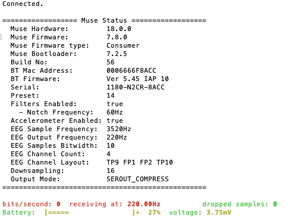
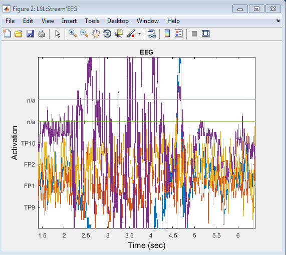

:orphan:

This is the series of steps to connect with the Muse.

1. Download the Muse SDK from http://developer.choosemuse.com
2. Pair your computer with your Muse headset and connect to your Muse using muse-io (replace Muse-XXXX with the name of your Muse device as it shows in the Bluetooth settings)
    ``muse-io --device Muse-XXXX --lsl-eeg EEG``

A successful connection should show like

3. Now the stream should be visible on your local network. To check this is the case, the easiest is to download the `LSL LabRecorder <https://github.com/labstreaminglayer/App-LabRecorder/releases>`_ for data acquisition. This will show you which streams are available and save them in XDF format if you wish to.
#. Download `liblsl-Matlab <https://github.com/labstreaminglayer/liblsl-Matlab/releases>`_
#. Start Matlab and add the folder liblsl-Matlab **with subfolder** to the Matlab path.
#. Clone the `Matlab viewer <https://github.com/labstreaminglayer/App-MATLABViewer/>`_.
#. Go to the folder above and execute ``vis_stream`` from the Matlab command prompt

**Alternative solution**

1. and 2. are identical

3. Clone `BCILAB <https://github.com/sccn/BCILAB>`_. BCILAB contains a version of the Matlab viewers as well as liblsl binaries for Matlab.
#. Start matlab and go to the folder above and type ``bcilab``
#. Go to the subfolder code/visualization of BCILAB and run _vis_stream_ (select all defaults and press OK)
#. If you have problem (such as Error using supergui (line 122) supergui error: argument 'fig' must be numeric), it could be due to the fact that you are using a newer Matlab version that is not compatible with some functions of BCILAB. If this is the case, then install the latest version of `EEGLAB <https://github.com/sccn/eeglab>`_ which will overload the functions that cause problem. Go to the newly downloaded EEGLAB folder and type ``eeglab``. Try again to run ``vis_stream`` as in Step 3.

You should now be able to stream Muse data

