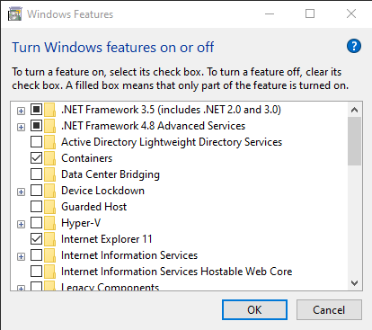

Network Troubleshooting
#######################

If a computer cannot see another computer's streams, the issue is usually the
firewall on one (or both) of the computers.
However, if you are working with untested client programs it is possible that a
stream is not visible just because the program has a bug (instead of due to a
networking error between two machines).

To test such a case, confirm that you are also unable to transmit data using
the example programs, e.g. :file:`labstreaminglayer/LSL/liblsl/bin/SendDataC`
and :file:`labstreaminglayer/LSL/liblsl/bin/ReceiveDataC`, respectively.

.. _firewallsettings:

Firewall Settings
*****************

The connections that are required by LSL to work in its default settings are

- UDP broadcasts to port 16571 and/or
- UDP multicast to port 16571 at

  - (`FF02:113D:6FDD:2C17:A643:FFE2:1BD1:3CD2`)
  - `FF05:113D:6FDD:2C17:A643:FFE2:1BD1:3CD2`
  - (`FF08113D:6FDD:2C17:A643:FFE2:1BD1:3CD2`)
  - (`FF0E:113D:6FDD:2C17:A643:FFE2:1BD1:3CD2`)
  - `224.0.0.1`, `224.0.0.183`, `239.255.172.215`

- TCP and UDP connections to the ports 16572-16604

To test whether the firewall is at issue, turn off both any personal firewall
that you may have enabled, and then also turn off the Windows default firewall
for the home or work network (if your network is declared home/work).
As long as you are behind a router in a non-public network this should be safe.

Windows Firewall
================

To turn off the Windows firewall, go to
:guilabel:`Start Menu->Control Panel->Windows Firewall->Turn Windows Firewall on or off`
(on the side panel) and then switch the Home or work (private) firewall to off
as in the below screen shot.

Do **not** turn off the public firewall, especially if you are on a laptop.

.. image:: ../images/firewall-turnoff.png

Do this on both computers.
Note that your home or work network might accidentally be declared as public
network: if this is the case your firewall status next to
:guilabel:`Home or work (private) networks` will be listed as "Not Connected"
and instead your current connection will show up under "Public networks" as in
the below screen shot.
You will want to correct this.

.. image:: ../images/firewall-badconfig.png

Keep in mind that a public wifi such as a campus network or coffee shop should
always stay under public networks -- you cannot safely disable the firewall for
such a network, and therefore cannot safely use LSL on a public wifi (the
campus network in the picture is actually a bad example for this switchover; it
shall stand here for a safe work network).

A password-protected or wired home/work network should instead be placed under
the home or work category, by going to
:guilabel:`Start Menu->Control Panel->Network and Sharing Center`.

Under :guilabel:`View your active networks` you should see your current
network, incorrectly labeled as "public network" as in the following screen shot.

.. image:: ../images/network-reconfig-a.png

Click on the public network and switch it to either work or home network.
Note that you may have to do this on both computers.

If you can now see streams across computers, you have found the root cause.
You might be able to re-enable your private-facing firewall and instead add
a rule to your firewall that allows your client programs through the network
(this can be done post-hoc in the firewall settings under
:guilabel:`Allow a program or feature through Windows Firewall`).
Most personal firewalls also allow you to set up per-program rules.

Windows Network Adapters
************************

Another possible reason is when you have multiple (perhaps virtual) network
adapters, and the primary network adapter is not the one that is used to
communicate with other machines on the lab network.

This can happen if you have a virtual machine monitor (e.g., VirtualBox)
installed and configured in an unfortunate way.
If this could be the case, you can test whether this is the reason by
temporarily disabling the offending network adapter and rerunning the LSL check.

It can also be the case that if the proper adapter is not set as the default
adapter, your LSL stream will not be broadcast to the correct network.

In order to set an adapter as default in Windows, open up
:guilabel:`Control Panel->Network and Internet->Network Connections`.

Hit :kbd:`Alt` to bring up the menu and select
:guilabel:`Advanced->Advanced Settings...`.
This will bring up a dialog with the available adapters listed at the top.
Move the desired adapter to the top of the list (drag and drop).
You will need administrator privileges to do this.

Future liblsl versions are planned to support multiple network devices.
You can track the progress in the issue tracker
(https://github.com/sccn/liblsl/pull/31).

.. image:: ../images/advanced_network_settings.png

You can also eliminate Hyper-V altogether by going to :guilabel:`Control Panel->Programs and Features->Turn Windows features on or off` and disabling Hyper-V. This requires admin priveges and a reboot.

If the vEthernet adapters persist, you may also need to go into :guilabel:`Control Panel->Device Manager`. From there, expand the :guilabel:`Network adapters` tab and uninstall the offending virtual adapters by right-clicking and choosing :guilabel:`Uninstall`.

For more information on these advanced settings, please read the following StackExchange article: https://superuser.com/questions/1282014/how-to-remove-all-the-vethernet-default-switch-once-and-for-all.

If you still have connection problems your router might be configured to
disable or block certain features or ports between computers.

Unix (Linux / macOS)
********************

To test stream resolution problems, you can log all incoming query packets with
the excellent ``socat`` utility:

.. code:: bash

  $ socat -d -d UDP-RECV:16571,reuseaddr,broadcast STDOUT
  2020/05/20 12:08:38 socat[16940] N using stdout for reading and writing
  2020/05/20 12:08:38 socat[16940] N starting data transfer loop with FDs [5,5] and [1,1]
  2020/05/20 12:08:39 socat[16940] N received packet with 65 bytes from AF=2 192.168.1.170:58967
  LSL:shortinfo
  session_id='default'
  16577 11973266323178842010

To log *all* broadcast packets, use
:samp:`UDP-RECV:16571,reuseaddr,broadcast` as source.

For a specific broadcast address 
:samp:`UDP-RECV:16571,reuseaddr,bind={224.0.0.183},ip-add-membership={224.0.0.183}:{enp0s25}`
where ``224.0.0.183`` is the broadcast address and (optionally) ``enp0s25``
your interface name.

For multicast packets, use
:samp:`UDP6-RECV:16571,reuseaddr,ipv6-join-group='[ff02:113D:6FDD:2C17:A643:FFE2:1BD1:3CD2]:enp0s25'`.
Note that the interface name may also be an interface index as printed by
:samp:`ip addr` (here ``wlan0`` has the interface index 4):

.. code:: bash

  [..]
  4: wlan0: <BROADCAST,MULTICAST,UP,LOWER_UP> mtu 1500 qdisc noqueue state UP group default qlen 1000
    link/ether 7c:7a:91:31:7d:56 brd ff:ff:ff:ff:ff:ff
    inet 192.168.1.110/24 brd 192.168.1.255 scope global dynamic noprefixroute wlan0
       valid_lft 6081sec preferred_lft 6081sec
    inet6 fe80::7e7a:91ff:fe31:7d56/64 scope link 
       valid_lft forever preferred_lft forever

Customizing Network Features of LSL
***********************************
All network features used by LSL clients (such as the ports) can be customized
using an appropriately-placed :doc:`configuration file <lslapicfg>`.

Security
********
Transmission between computers is unencrypted in LSL under the assumption that experiments involving sensitive data take place in a protected network environment. If you do not trust your network, the best way to establish such an environment by setting up a Virtual Private Network (VPN), which works even across the internet.

Remote Connections
******************
Connecting Outlets and Inlets across the internet can be risky but can sometimes be 
necessary.

In order to enable a connection between two separate networks, there might be a number of 
firewalls that might block traffic. Let's identify these points:

- Forward outbound ports :samp:`16571 - 16604` for TCP/UDP on the Outlet's OS Firewall
- Forward ports :samp:`16571 - 16604` for TCP/UDP on the Outlet's Endpoint (Router)
- Forward ports :samp:`16571 - 16604` for TCP/UDP on the Inlet's Endpoint (Router/Virtual Firewall)
- Forward inbound ports :samp:`16571 - 16604` for TCP/UDP on the Inlet's OS Firewall

Keep in mind that there are many possible setups for local networks. There may be additional 
firewalls or network layers blocking your stream. If you believe this to be the case, please 
consult your local IT or network administrator for help.

An issue may pop up on some home networks regarding IP address reassignments. If you find 
that your network keeps reassigning your device with a different local IP over time, please 
consult your router's manual for turning on a static/reserved IP address for the data 
streaming device. It is often a requirement that a local network device has a static/reserved 
IP address in order to have its ports forwarded.

Once all ports are forwarded on both sides, both outlet and inlet IP addresses need 
to be added to the :samp:`KnownPeers` setting in the configuration file. This will override 
the multicast discovery mechanism and only allow pairing between those endpoints. While 
you're in the file, make sure the :samp:`SessionID` setting is something other than default for 
debugging and courtesy purposes.

Distribute this configuration file between the outlet and inlet and *make sure the 
directory and file names are correct per your OS distrubution.* **If the name of the file is 
not exactly :samp:`lsl_api.cfg`, liblsl will not read it.**

Finally to test that a remote connection is established, use a outlet/inlet 
test using example files such as:

https://github.com/chkothe/pylsl/blob/master/examples/SendData.py
https://github.com/chkothe/pylsl/blob/master/examples/ReceiveData.py

Regardless of what test applications used, make sure to make modifications so that the Inlet 
prints received data to a file or console.

Run your Inlet program on one device and check its port visibility by using a tool such as 
https://www.yougetsignal.com/tools/open-ports/. The port will only appear open when an 
application is listening to it.

Then run your Outlet program on the other device. Ensure that the data is printed to the 
Inlet console and that the :samp:`SessionID` value is correct. 

If problems persist, narrow down the possibilities. Try running both the Outlet and 
Inlet on a single device. Try pinging from the Outlet to the Inlet 
(Make sure to turn on ICMP). Try turning off all possible firewalls instead of adding rules. 

Wireless Connections
********************

There are some settings that can be modified to help LSL perform more reliably across
wireless networks. Please see the [tuning] section at the bottom of the :doc:`lslapicfg` 
documentation for more information.
