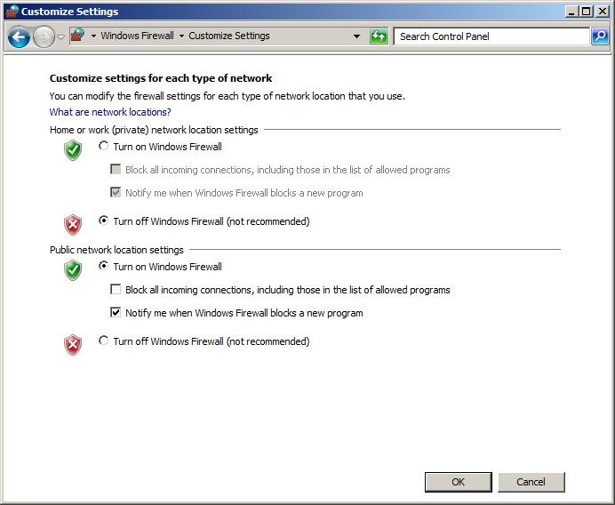
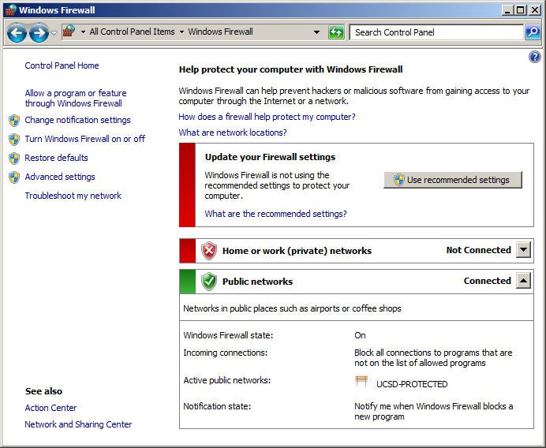
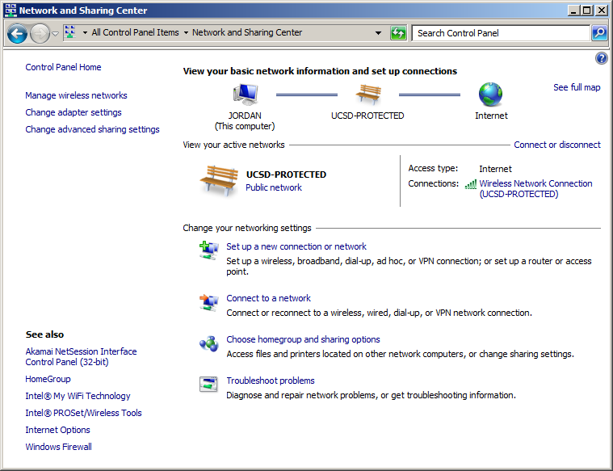
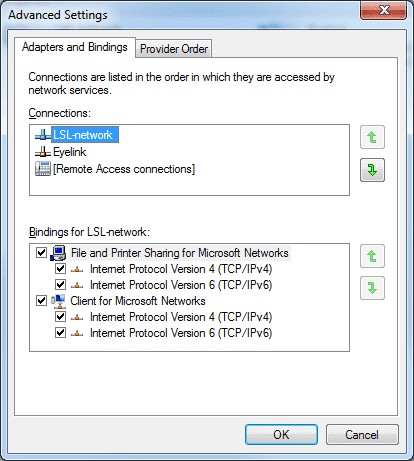

Network Troubleshooting
#######################

If a computer cannot see another computer's streams, the issue is usually the
firewall on one (or both) of the computers.
However, if you are working with untested client programs it is possible that a
stream is not visible just because the program has a bug (instead of due to a
networking error between two machines).

To test such a case, confirm that you are also unable to transmit data using
the example programs, e.g. :file:`labstreaminglayer/LSL/liblsl/bin/SendDataC`
and :file:`labstreaminglayer/LSL/liblsl/bin/ReceiveDataC`, respectively.

.. _firewallsettings:

Firewall Settings
*****************

The connections that are required by LSL to work in its default settings are

- UDP broadcasts to port 16571 and/or
- UDP multicast to port 16571 at

  - (`FF02:113D:6FDD:2C17:A643:FFE2:1BD1:3CD2`)
  - `FF05:113D:6FDD:2C17:A643:FFE2:1BD1:3CD2`
  - (`FF08113D:6FDD:2C17:A643:FFE2:1BD1:3CD2`)
  - (`FF0E:113D:6FDD:2C17:A643:FFE2:1BD1:3CD2`)
  - `224.0.0.1`, `224.0.0.183`, `239.255.172.215`

- TCP and UDP connections to the ports 16572-16604

To test whether the firewall is at issue, turn off both any personal firewall
that you may have enabled, and then also turn off the Windows default firewall
for the home or work network (if your network is declared home/work).
As long as you are behind a router in a non-public network this should be safe.

Windows Firewall
================

To turn off the Windows firewall, go to
:guilabel:`Start Menu->Control Panel->Windows Firewall->Turn Windows Firewall on or off`
(on the side panel) and then switch the Home or work (private) firewall to off
as in the below screen shot.

Do **not** turn off the public firewall, especially if you are on a laptop.

Do this on both computers.
Note that your home or work network might accidentally be declared as public
network: if this is the case your firewall status next to
:guilabel:`Home or work (private) networks` will be listed as "Not Connected"
and instead your current connection will show up under "Public networks" as in
the below screen shot.
You will want to correct this.

Keep in mind that a public wifi such as a campus network or coffee shop should
always stay under public networks -- you cannot safely disable the firewall for
such a network, and therefore cannot safely use LSL on a public wifi (the
campus network in the picture is actually a bad example for this switchover; it
shall stand here for a safe work network).

A password-protected or wired home/work network should instead be placed under
the home or work category, by going to
:guilabel:`Start Menu->Control Panel->Network and Sharing Center`.

Under :guilabel:`View your active networks` you should see your current
network, incorrectly labeled as "public network" as in the following screen shot.

Click on the public network and switch it to either work or home network.
Note that you may have to do this on both computers.

If you can now see streams across computers, you have found the root cause.
You might be able to re-enable your private-facing firewall and instead add
a rule to your firewall that allows your client programs through the network
(this can be done post-hoc in the firewall settings under
:guilabel:`Allow a program or feature through Windows Firewall`).
Most personal firewalls also allow you to set up per-program rules.

Windows Network Adapters
************************

Another possible reason is when you have multiple (perhaps virtual) network
adapters, and the primary network adapter is not the one that is used to
communicate with other machines on the lab network.

This can happen if you have a virtual machine monitor (e.g., VirtualBox)
installed and configured in an unfortunate way.
If this could be the case, you can test whether this is the reason by
temporarily disabling the offending network adapter and rerunning the LSL check.

It can also be the case that if the proper adapter is not set as the default
adapter, your LSL stream will not be broadcast to the correct network.

In order to set an adapter as default in Windows, open up
:guilabel:`Control Panel->Network and Internet->Network Connections`.

Hit :kbd:`Alt` to bring up the menu and select
:guilabel:`Advanced->Advanced Settings...`.
This will bring up a dialog with the available adapters listed at the top.
Move the desired adapter to the top of the list (drag and drop).
You will need administrator privileges to do this.

Future liblsl versions are planned to support multiple network devices.
You can track the progress in the issue tracker
(https://github.com/sccn/liblsl/pull/31).

If you still have connection problems your router might be configured to
disable or block certain features or ports between computers.

Customizing Network Features of LSL
***********************************
All network features used by LSL clients (such as the ports) can be customized
using an appropriately-placed :doc:`configuration file <lslapicfg>`.

Security
********
Transmission between computers is unencrypted in LSL under the assumption that experiments involving sensitive data take place in a protected network environment. If you do not trust your network, the best way to establish such an environment by setting up a Virtual Private Network (VPN), which works even across the internet.
