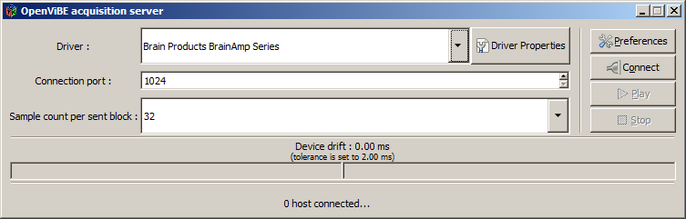
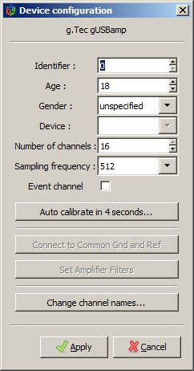

:orphan:

OVAS
####
The OpenViBE acquisition server (OVAS) is an open-source program that is part of the OpenViBE distribution and OpenViBE project (http://openvibe.inria.fr/) developed at INRIA. The OVAS supports a wide range of EEG hardware by itself, and is almost entirely complementary to what the LSL distribution is offering. Together both distributions cover the majority of the EEG market. As of version 1.0, the OVAS supports LSL as an output modality.

To enable LSL output, click on Preferences in the OVAS application, check the box labeled LSL_EnableLSLOutput, and click apply. This setting will only have to be chosen once. After that, you connect to your EEG device as documented in the OpenVibe manuals., and click Play to enable streaming.

Problem with timestamps
***********************
Once upon a time, and possibly still in the version you have, OVAS incorrectly overrides the timestamps.
This makes it impossible to synchronize streams obtained from OVAS with streams obtained from non-OVAS sources.
There is a solution. Follow this link for more info: http://openvibe.inria.fr/tracker/view.php?id=197

Minimizing Latency
******************
The OVAS outputs the data in equal-sized chunks, and the chunk size determines most of the latency of the program. To minimize this latency, use the lowest possible setting under "Sample count per sent block". Some device drivers also offer options that indirectly affect the latency, for example the "Brain Products BrainAmp series" driver has an option called "Decimation factor", which serves to reduce the effective sampling rate (default=10x). The length of the output buffer (in seconds) is proportional to this factor, so a lower value will give you lower latency.
